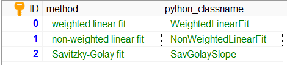

Provide an additional user-selectable algorithm subsystem
---------------------------------------------------------

An example of user-selectable algorithm subsystems is the method for
the calculation of the
signal slope in the extinction retrieval.
It is described :doc:`here <example_SignalSlope>` .

There are two algorithms already available, but the developer might
want to add another option

* Savitzky-Golay fit

Step 1
^^^^^^

In a first step, the new method needs to be added in the SCC
database table `_ext_methods`.

Step 2
^^^^^^

Next, you need to add a new module :mod:`ELDAmwl.plugins.SavitzkyGolaySlope`
in the directory `ELDAmwl.plugins`.
In this module, you can create and register a new class with the name that
was provided in the database table.

.. code:: python

    # -*- coding: utf-8 -*-
    """plugin for calculation of slope with Savitzky-Golay method"""

    from ELDAmwl.extinction_factories import SignalSlope
    from ELDAmwl.registry import registry

    class SavGolaySlope(object):

        name = 'SavGolaySlope'

        def __init__(self, **kwargs):
            print('create SavGolaySlope ')

        def run(self, **kwargs):
            print('run SavGolaySlope ')

    registry.register_class(SignalSlope,
                            SavGolaySlope.__name__,
                            SavGolaySlope)

.. note::

    The new class needs to have a name attribute, as well as
    __init__() and run() methods which accepts keyword arguments.

Step 3
^^^^^^

In a last step, the new module needs to be announced to the ELDAmwl package.
This is done by adding an import statement into the :mod:`ELDAmwl.plugins.plugin` module.

.. code:: python

    # -*- coding: utf-8 -*-
    """import of all plugins"""

    import ELDAmwl.plugins.SavitzkyGolaySlope

